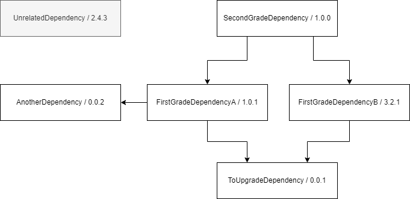

# NugetPackageUpgrader

## Summary 

NugetPackageUpgrader is a .NET tool that helps you to upgrade your nuget package versions.
Given a project file NugetPackageUpgrader will upgrade the version of the package, build a new package
and then look for packages within your solution that depend on this package.
On any project that has a dependency to the specified package NugetPackageUpgrader will update the
reference and upgrade the project. This is done for all transitive dependencies.

## How to use

`nugetupgrader -p [YourPackageName]`

```
-o, --output              The directory, where generated nuget packages arecopied to.

-s, --sln-path            The solution, that contain the packages that shouldbe upgraded.

-p, --project             Required. The project, that should be upgraded.

-v, --verbose             Enable verbose logging.

-r, --release-strategy    Choose the release strategy. Valid values: Prerelease, ReleaseMajor, ReleaseMinor, ReleasePatch

-c, --set-version         Set a custom version.

-d, --sln-directory       The directory to look for a solution file. Defaultsto the directory of execution.

--help                    Display this help screen.

--version                 Display version information.
```

### Example

Lets assume the following dependency graph.


After we run `nugetupgrader -p ToUpgradeDependency -r ReleasePatch` all dependencies and transitive dependencies are upgraded to the next patch version.
Please note that `SecondGradeDependency` is upgraded from 1.0.0 to 1.0.2. This is because it is upgraded twice. We are working on a solution.


### Release Strategies

The `-r` option allows for different release strategies. Depending on the strategy the major, minor, patch or prerelease version is increased.
When specifying the `-c` flag following a version number the specified projects version is set to that version.
All transitive dependencies are upgraded using the `-r` strategy.


